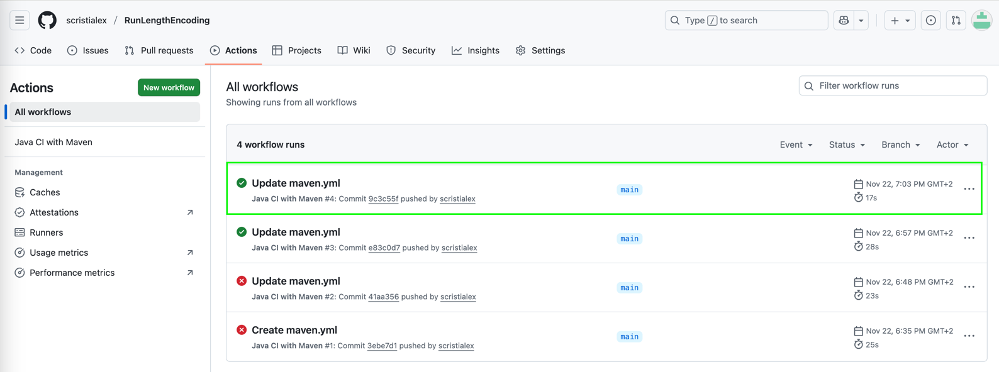
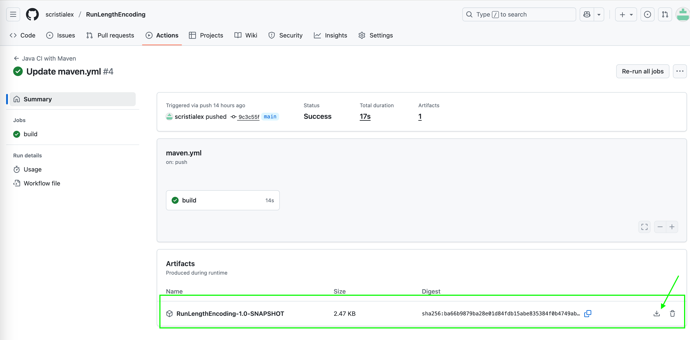
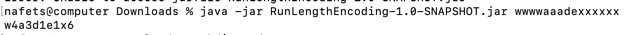

# Exercise: Run Length Encoding

Given a string, your task is to  complete the function **encode** that returns the **run length encoded** string for the given string.

**eg** if the input string is “wwwwaaadexxxxxx”, then the function should return “w4a3d1e1x6″.

You are required to complete the function **encode** that takes only one argument the string which is to be encoded and returns the encoded string.

**Example 1:**

Input:
str = aaaabbbccc

Output: a4b3c3

Explanation: a repeated 4 times consecutively b 3 times, c also 3 times.


**Example 2:**

Input:
str = abbbcdddd

Output: a1b3c1d4

Your Task:

Complete the function **encode()** which takes a character array as a input parameter and returns the encoded string. .   You can use Java/C#/NodeJS for this exercise and an IDE of your choice.

# Solution

**Prerequisites**
- For running the solution:
  - Java: 24
  - Maven: 3.9.11
  - Access to GitHub for downloading the jar package
- For creating a new build and running the JUnit tests:
    - Java: 24
    - Maven: 3.9.11
    - Access to GitHub or Git for cloning the repository

**Running the solution**
1. Download the jar package

    - Go to the [RunLengthEncoding](https://github.com/scristialex/RunLengthEncoding) repository
    - Enter in the *Actions* tab
    - Double click the most recent successful workflow
    
    - Download the *RunLengthEncoding-1.0-SNAPSHOT.jar* artifact
    
2. Unzip the file
3. Run the jar using:

   ```java -jar RunLengthEncoding-1.0-SNAPSHOT.jar yourTestString```

   For example:

```java -jar RunLengthEncoding-1.0-SNAPSHOT.jar wwwwaaadexxxxxx```



**Create a new build and run the unit testing**
1. Create a directory of your own choice. In this example we use *code*
2. Navigate to your newly created directory:

```cd code```
3. Clone the repository

```git clone git@github.com:scristialex/RunLengthEncoding.git```

4. Change directory to *RunLengthEncoding* 

```cd RunLengthEncoding```

5. Create a new build and run the unit tests

```mvn clean install```

6. If you need to only run the unit tests:

```mvn test```

7. verify the test report:

```cat target/surefire-reports/org.example.RunLengthEncodingTest.txt```

